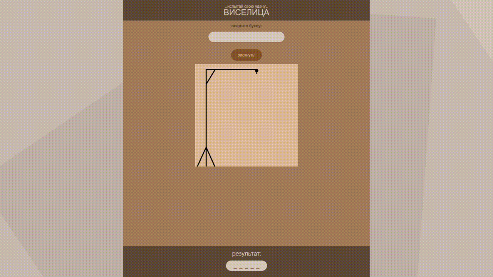
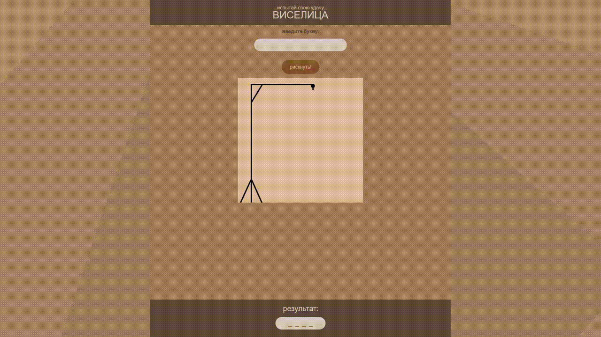
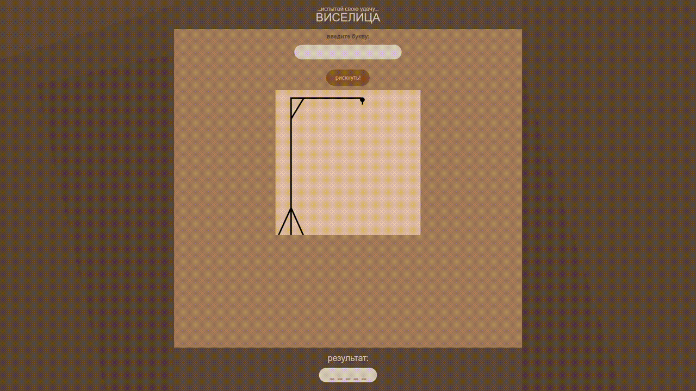
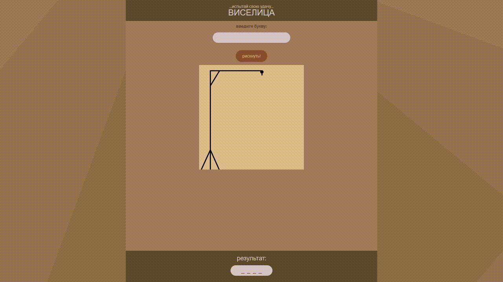
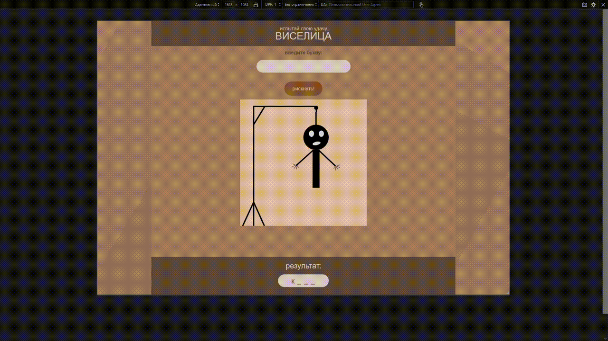

  
 

# О проекте

Интерактивная игра виселица, реализованная на нативном JS. 
Игра выполнена в виде SPA (Single Page Application) и имеет адаптивный дизайн для корректного отображения на различных устройствах. 
Для стилизации использован препроцессор SCSS.

Открыть страницу: https://linacor.github.io/the-gallows-game/

# Функциональность
Игроку предлагается угадать слово, загаданное скриптом. Если игрок называет букву, которая присутствует в слове, то она открывается, если нет, то на игровом поле появляется новый элемент виселицы. 
Реализованы следующие проверки поля ввода:
- отправка пустой строки,
- отправка двух и более символов,
- отправка чисел и не кириллических символов,
- отправка не уникальных значений.

# Демонстрация 
## Desktop version
1. Игровой процесс

2. Отправка пустой строки

3. Отправка двух и более символов

4. Отправка английских букв и чисел

5. Отправка повторяющихся букв

## Mobile version
